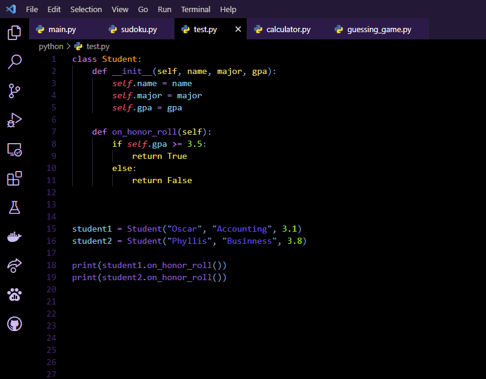
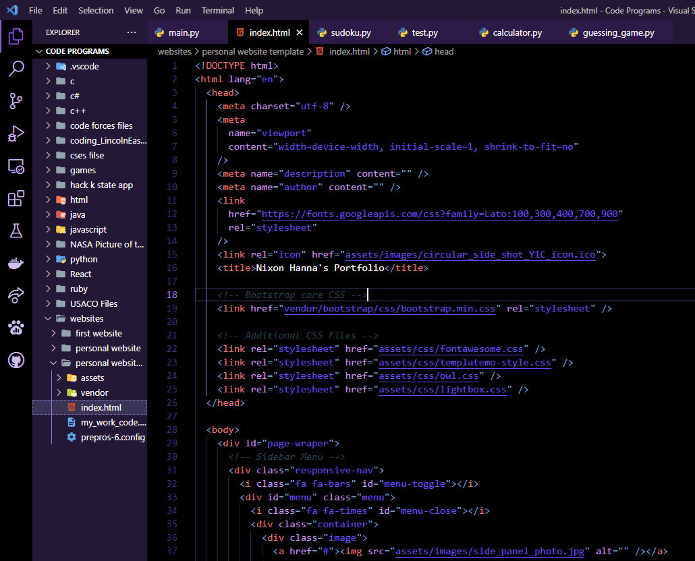
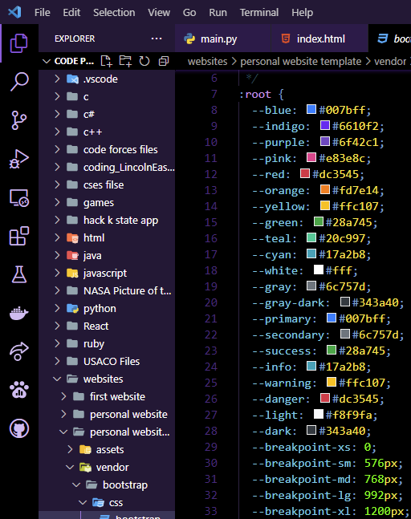
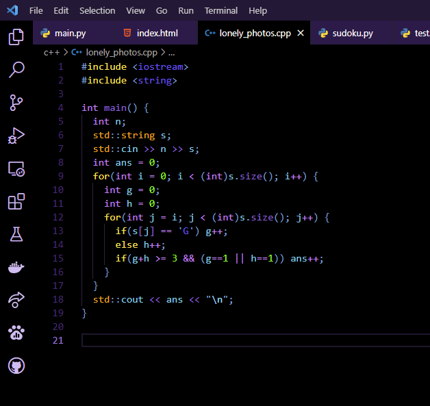

# Epic Gamer Theme - the theme for epic gamers

 

## Screenshots

### Python

    

### HTML

    

### CSS

    

### C++

      
 

## Installation

1 - Open the Extensions sidebar panel from within the Visual Studio Code editor window.  
Menu Path : View > Extensions  
Keyboard Shortcut : `Ctrl + Shift + X`    

2 - Search for the theme in the extension marketplace search and then click the Install button.  
Search : `Epic Gamer Theme`    

3 - Enable the installed theme from the Color Theme drop down list.  
Menu Path : Code / File > Preferences > Color Theme > Theme +  
Keyboard Shortcut : `Ctrl + K Ctrl + T`      

## Feedback

Please report spottings of bright red (other than error highlights on the minimap) and any other feedback/issues.  

[GitHub Repository](https://github.com/nhanna95/epic-gamer-theme/issues)      

## License

__MIT License__

 

This work is licensed under the terms of the license available below. 

__License :__ [MIT License](https://opensource.org/licenses/MIT)
